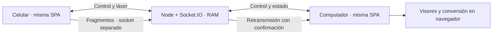

# Pronter

Una SPA para presentar archivos del celular en otra pantalla. La pantalla muestra un QR; el primer celular que lo escanea toma el mando. Sin cuentas, base de datos, historial ni almacenamiento de archivos.

## Ejecutar

Necesitas Node.js 22.18 o superior.

```sh
npm ci
npm run dev
```

Abre **http://localhost:5173** en el computador. El QR utiliza automáticamente una IP privada del equipo para probar con un celular en la misma red. Si tienes varias interfaces o una VPN, configura `PUBLIC_URL` con la dirección accesible desde el celular. El puerto 5173 debe ser accesible en esa red.

Para ejecutar la compilación de producción:

```sh
npm run build
npm start
```

## Publicar en Internet

Despliega **un solo proceso Node**, con soporte de WebSocket y HTTPS. Ese proceso sirve la SPA y retransmite los sockets. No necesita OnlyOffice, LibreOffice, FFmpeg nativo, base de datos ni volúmenes para archivos. Un alojamiento exclusivamente estático no puede retransmitir la conexión entre dos dispositivos.

Copia `.env.example` a `.env` y configura:

```dotenv
PORT=5173
PUBLIC_URL=https://tu-dominio.example
RECONNECT_GRACE_MS=20000
```

`PUBLIC_URL` es el origen completo, sin ruta ni barra final; debe coincidir con el dominio que abres. El proxy debe permitir la actualización de conexiones WebSocket en `/socket.io/`. Para un despliegue sencillo mantén una única instancia: las asociaciones existen en la RAM de ese proceso y no se comparten entre réplicas.

También puedes construir el contenedor incluido:

```sh
docker build -t pronter .
docker run --rm -p 5173:5173 -e PUBLIC_URL=https://tu-dominio.example pronter
```

El proveedor o proxy que utilices termina HTTPS. Este proyecto todavía no está publicado en un dominio público.

### Opción gratuita: Render

El archivo `render.yaml` define un único **Web Service** Node con `plan: free`, comprobación de salud y despliegues manuales. La app toma automáticamente el dominio HTTPS de `RENDER_EXTERNAL_URL`, así que el QR y la validación del origen de los sockets utilizan el dominio público. Para un dominio propio, configura `PUBLIC_URL`.

Para publicarlo, sube el proyecto a un repositorio privado de GitHub, conecta ese repositorio a Render y crea un Blueprint desde `render.yaml`. Mantén el espacio de trabajo en **Hobby**, el servicio en **Free** y sin método de pago. Si lo creas manualmente, usa `npm ci --include=dev && npm run build` como comando de compilación, `npm start` para iniciarlo y `/api/health` como comprobación de salud. No agregues bases de datos ni discos.

Condiciones consultadas el 9 de octubre de 2026: 750 horas de instancia gratuita por espacio de trabajo al mes; el servicio se suspende después de 15 minutos sin tráfico y puede tardar aproximadamente un minuto en arrancar al volver a abrirlo. Hobby incluye **5 GB de salida al mes**, compartidos por los servicios del espacio de trabajo: archivos retransmitidos y recursos de los visores consumen ese cupo. Sin método de pago, al agotarlo se suspenden los servicios gratuitos hasta el siguiente mes; al agotar los minutos de compilación se deshabilitan las nuevas compilaciones. Con un método de pago agregado, puede haber cargos por consumo adicional. [Condiciones gratuitas](https://render.com/docs/free), [ancho de banda](https://render.com/docs/outbound-bandwidth), [variables de entorno](https://render.com/docs/environment-variables).

El plan gratuito permite uso ocasional y pruebas; no garantiza disponibilidad continua. Render puede reiniciar la instancia: como la asociación vive solo en RAM, en ese caso se renueva el QR y debes volver a escanearlo. El tráfico de mensajes WebSocket cuenta como actividad; no se añade un servicio externo para mantenerlo despierto. [WebSockets](https://render.com/docs/websocket).

## Presentar

1. Abre Pronter en el computador y, si quieres, activa pantalla completa con el botón de la esquina.
2. Escanea el QR con la cámara del celular. Se abre el mando en el mismo sitio.
3. Selecciona un archivo. Se prepara y muestra en el computador; los controles cambian según su formato.
4. Usa **Láser** para señalar mientras mantienes y deslizas el dedo. Elige **Marcador** para dibujar desde el panel del celular mirando la pantalla del computador; el panel representa el área visible del archivo.
5. El marcador ofrece cinco colores, dos grosores, **Deshacer** y **Borrar**. También puedes activar **Dibujar en el PC** y trazar directamente sobre el contenido. Cada página o diapositiva conserva sus dibujos; borrar afecta solo a la página actual. Los trazos acompañan al contenido con el zoom, el desplazamiento y los cambios de tamaño.
6. Envía otro archivo para sustituir el contenido y eliminar los trazos anteriores. El anterior permanece hasta que el nuevo esté listo. Si falla, se conservan el archivo anterior y sus dibujos y se muestra el error.
7. Pulsa **Salir** en el celular: el computador muestra «Sesión terminada», libera el contenido y los trazos y recarga después de dos segundos con otro QR.

El segundo celular recibe un rechazo. Tras detectar una desconexión, la asociación queda reservada durante 20 segundos y se recupera únicamente con la credencial privada que mantiene en memoria el dispositivo original. Al abrir el selector de archivos desde el mando, la reserva del celular se amplía hasta 10 minutos para tolerar que el navegador quede suspendido mientras buscas el archivo. Al volver, el mando recupera la conexión automáticamente; el archivo elegido espera hasta 30 segundos a que ambos canales estén listos antes de enviarse. Una recarga del celular pierde la credencial. Si vence la reserva o pulsas **Salir**, se cierra la asociación y se renueva el QR.

Las pruebas locales por IP funcionan con HTTP, también para enviar archivos y usar los controles. Después de actualizar la aplicación o reiniciar el servidor, recarga la página del computador, cierra la pestaña anterior del celular y escanea el QR nuevo para cargar la misma versión en ambos dispositivos.

Algunos navegadores requieren un clic en **Activar audio** en el computador antes de permitir sonido. La pantalla completa también se activa desde el computador porque el navegador exige un gesto local. El botón muestra **Salir de pantalla completa** cuando está activada; puedes alternarla con **F** y salir con **Esc**.

## Visores y límites

| Contenido | Visor | Controles |
|---|---|---|
| JPG, PNG, WebP, GIF, AVIF, SVG | Navegador; SVG saneado | Zoom, ajuste, desplazamiento, láser, marcador |
| HEIC / HEIF | libheif en Worker, primera imagen | Zoom, ajuste, desplazamiento, láser, marcador |
| PDF | PDF.js con Worker | Página, zoom, ajuste, desplazamiento, láser, marcador |
| PPTX y PPT | `@web-ppt/core` + `@web-ppt/viewer-core`, análisis en Worker | Diapositivas, avances de animación, vista estática, zoom, láser, marcador |
| MP3, WAV, M4A, AAC, OGG, FLAC, Opus | Reproductor nativo y conversión cuando es necesaria | Play/pausa, volumen, silencio, posición, velocidad |
| MP4, WebM, MOV, MKV, AVI | Reproductor nativo y conversión cuando es necesaria | Reproducción, volumen, posición, velocidad, zoom, láser, marcador |
| Markdown | React Markdown + GFM, sin HTML crudo | Desplazamiento, zoom, láser, marcador |

- Transferencia máxima: **1 GB decimal**, 1.000.000.000 bytes. No se lee el archivo entero en el celular: se envían fragmentos de 256 KiB, con cuatro como máximo pendientes de confirmación.
- Si el navegador no reproduce un audio o video, **FFmpeg WASM convierte en el computador**. La entrada y salida de conversión se limitan a **200 MB**; video de salida H.264/AAC hasta 1920×1080 y audio MP3. No hay conversión en el servidor. Un formato incompatible que exceda ese límite produce un aviso y conserva la presentación anterior.
- Admitir una transferencia de 1 GB no garantiza que todo documento de ese tamaño pueda decodificarse: el visor depende de la RAM disponible. Las imágenes se limitan a 50 megapíxeles, las páginas PDF a un lienzo de 16 megapíxeles y se valida la expansión ZIP de PPTX antes de descomprimir.
- PowerPoint se representa con un motor web: fuentes, SmartArt, videos y efectos propietarios pueden diferir del original. La vista estática ayuda a presentar documentos con efectos incompatibles. Los archivos protegidos con contraseña deben enviarse sin protección.
- No se fuerza la descarga. Los recursos remotos de documentos y sus enlaces se bloquean; las imágenes externas de Markdown aparecen como un aviso. No se ejecutan scripts, macros ni HTML del archivo.
- La opción de movimiento reducido desactiva las animaciones decorativas y usa PowerPoint estático.
- El marcador mantiene hasta 250 trazos por página, 1.000 por archivo y 50.000 puntos en total. Un trazo admite 10.000 puntos; los avisos indican cuándo debes levantar el dedo o borrar dibujos. La capa Canvas se limita a 16 megapíxeles. El audio no tiene una superficie visual para dibujar.

El mando también ofrece pantalla negra y temporizador local. En el computador: flechas o PageUp/PageDown cambian páginas; espacio avanza o reproduce; **B** activa pantalla negra y **F** pantalla completa.

## Privacidad y arquitectura



Los archivos y los dibujos solo se acumulan en el navegador anfitrión. El celular muestra temporalmente el gesto actual como guía. El servidor conserva temporalmente los identificadores de asociación, las claves aleatorias y el estado del visor; retransmite un número limitado de fragmentos y los lotes del marcador, sin ensamblar el archivo, conservar los trazos ni escribirlos a disco. Al salir o vencer el plazo se elimina la asociación. Al sustituir contenido se destruye su visor, se eliminan sus dibujos y se revocan sus URLs temporales.

Los puntos del marcador viajan en lotes de hasta 32, con un máximo de cuatro confirmaciones pendientes y una cola limitada. Se confirma el inicio del trazo antes de enviar sus puntos; al cortar la conexión o cambiar de vista se descartan los lotes pendientes y se conserva únicamente lo que la pantalla recibió. El orden del canal está respaldado por las [garantías de Socket.IO](https://socket.io/docs/v4/delivery-guarantees/).

La app no utiliza cookies, localStorage, sessionStorage, IndexedDB, service workers, métricas, cuentas ni registros de solicitudes. Fuentes, bibliotecas y WASM se sirven desde el propio sitio. El navegador puede cachear esos recursos públicos; eso no es un historial de presentaciones. La política de registros del proveedor de alojamiento se configura por separado. El cifrado de transporte depende de publicar con HTTPS.

## Verificación

```sh
npm run typecheck
npm test
npx playwright install chromium
npm run build
npm run test:e2e
```

Las pruebas de Socket.IO comprueban concurrencia de admisión, autenticación, caducidad, reserva del selector de archivos, cierre, fragmentos duplicados/fuera de orden y una transferencia real de 1 GB sin ensamblarla en el servidor de prueba. Las pruebas de navegador decodifican el QR renderizado y conectan dos contextos independientes: recepción, páginas PDF/PPTX, Markdown, audio, video, conversión AVI, sustitución, preservación ante error, láser, rechazo de otro celular, reconexión, ausencia de almacenamiento y cierre. También comprueban el envío desde una IP local por HTTP, una suspensión de 16 segundos durante la selección, un corte de red de 22 segundos y la recuperación de un rechazo temporal del canal de archivos.

Los resultados y límites de la verificación realizada están en [VALIDATION.md](VALIDATION.md).

Para verificar un despliegue público desde este computador, usa su URL en `PRONTER_E2E_URL`. Las pruebas abren dos navegadores independientes, comprueban que el QR apunta al mismo dominio y no arrancan otro servidor local. El escenario específico de HTTP en la red local se omite cuando el sitio utiliza HTTPS.

```powershell
$env:PRONTER_E2E_URL = 'https://tu-servicio.onrender.com'
npm run test:e2e
Remove-Item Env:PRONTER_E2E_URL
```

Los pequeños MP4/AVI de prueba se generan con `node scripts/create-test-media.mjs`. HEIC y PPT antiguo tienen pruebas adicionales opcionales con ejemplos oficiales, excluidos del control de versiones:

```powershell
Invoke-WebRequest 'https://raw.githubusercontent.com/strukturag/libheif/master/examples/example.heic' -OutFile 'tests/fixtures/example.heic'
Invoke-WebRequest 'https://raw.githubusercontent.com/unStone/web-ppt/master/fixtures/sample.ppt' -OutFile 'tests/fixtures/sample.ppt'
Invoke-WebRequest 'https://raw.githubusercontent.com/unStone/web-ppt/master/fixtures/sample-editor-image-content.pptx' -OutFile 'tests/fixtures/embedded.pptx'
Invoke-WebRequest 'https://raw.githubusercontent.com/unStone/web-ppt/master/fixtures/sample-animation-effects.pptx' -OutFile 'tests/fixtures/animated.pptx'
```

Fuentes de esos ejemplos: [libheif](https://github.com/strukturag/libheif/blob/master/examples/example.heic), [web-ppt](https://github.com/unStone/web-ppt/tree/master/fixtures). Las pruebas con pantalla pequeña usan emulación; la validación en un celular físico aún está pendiente.

## Estructura

- `src/App.tsx`: landing, proyector y mando de la SPA.
- `src/connection.ts`: canales independientes y reconexión.
- `src/presenter.ts`: recepción y sustitución del visor preparado.
- `src/viewers/`: adaptadores con controles y liberación de recursos.
- `src/viewers/annotation-layer.ts`: Canvas sobrepuesto, coordenadas del contenido y dibujo directo en el computador.
- `src/components/MarkerTools.tsx`: paleta, grosor, controles y panel para dibujar desde el celular.
- `src/lib/ink-store.ts` y `src/lib/ink-gesture.ts`: dibujos por página en RAM y envío de lotes con límites.
- `src/workers/`: lectura de PowerPoint e imágenes HEIC.
- `server/broker.ts`: admisión exclusiva y retransmisión efímera.
- `shared/protocol.ts`: límites y contratos validados.
- `tests/`: pruebas de contratos, sockets y navegadores.

La dirección visual usa Bricolage Grotesque y DM Sans, azul eléctrico, papel lavanda y acentos coral. Ilustraciones SVG/CSS propias, estados claros, controles táctiles de al menos 44 px y animaciones breves que respetan movimiento reducido.

Las dependencias y sus versiones están fijadas en `package-lock.json`. Consulta `THIRD_PARTY_NOTICES.md` para los componentes distribuidos.
